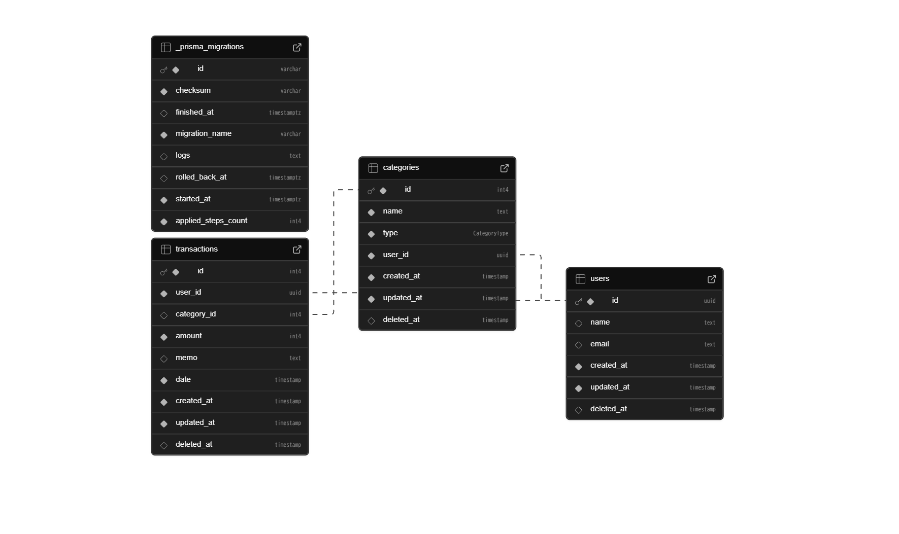

# データベース設計

## 概要
家計簿アプリのデータベース設計。Supabase (PostgreSQL) を使用。

## ER図

## テーブル一覧

### User
ユーザー情報を管理

| カラム名 | 型 | 説明 |
|---------|------|------|
| id | String (UUID) | 主キー |
| email | String | メールアドレス（ユニーク） |
| name | String | ユーザー名 |
| created_at | DateTime | 作成日時 |
| updated_at | DateTime | 更新日時 |
| deleted_at | DateTime | 削除日時（論理削除） |

### Transaction
収支の取引情報

| カラム名 | 型 | 説明 |
|---------|------|------|
| id | String (UUID) | 主キー |
| user_id | String | ユーザーID（外部キー） |
| category_id | String | カテゴリID（外部キー） |
| amount | Decimal | 金額 |
| date | DateTime | 取引日 |
| note | String | メモ（任意） |
| created_at | DateTime | 作成日時 |
| updated_at | DateTime | 更新日時 |
| deleted_at | DateTime | 削除日時（論理削除） |

### Category
カテゴリ情報（食費、交通費など）

| カラム名 | 型 | 説明 |
|---------|------|------|
| id | String (UUID) | 主キー |
| user_id | String | ユーザーID（外部キー） |
| name | String | カテゴリ名 |
| type | String | 種別（income/expense） |
| created_at | DateTime | 作成日時 |
| updated_at | DateTime | 更新日時 |
| deleted_at | DateTime | 削除日時（論理削除） |

## マイグレーション履歴

- \20251207061114_init\ - 初期テーブル作成
- \20251220103655_convert_to_snake_case\ - カラム名をスネークケースに変換

## 環境

- **ローカル開発**: Docker + PostgreSQL
- **Staging**:  Supabase (PostgreSQL)
- **ORM**: Prisma

## 参考リンク

- [Prisma Schema](../../prisma/schema.prisma)
- [Supabase Dashboard](https://supabase.com/dashboard/project/qjlxxswqzwexdvqpqwdg/database/schemas)
